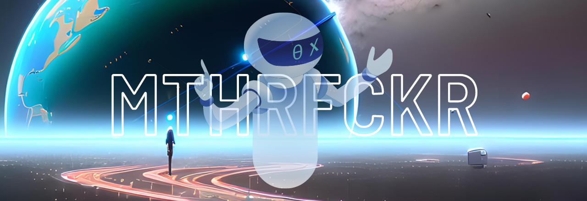

# README

## AI-MTHRFCKR Web Version

***

**This Is A Repository Of Various Artificial Intelligence Applications, Grouped Into Different Categories Such As Art & Image, Audio, Business, And More. The Repository Provides An Overview Of The Applications Of AI In Different Fields And Serves As A Resource For Those Interested In Exploring The Capabilities Of AI. Each Section Includes Examples Of AI Projects, Tools, And Technologies Within The Specific Category, Along With Relevant Resources For Further Learning And Exploration.**

**Follow Me on Twitter for More Resources!** [wh0isdsmith](https://twitter.com/wh0isdsmith)

***

* **This Is A Continuous Work In Progress.**
* **I Use My Own Personal Aggregator That Pulls From Many Sites And Dumps It Into My Obsidian Vault, If Anything Posted Here Is Your Work And You Want Credit For It, Just Let Me Know And I Apologize If I Have Missed Given You Credit So Far!**

***

`Fun Fact This README Is Continuously Being Updated And Generated By ChatGPT`

***

* [Table Of Contents](ai-mthrfckr/table-of-contents.md)
* [Recently Added](ai-mthrfckr/recently-added.md)
* [AI-Apps](ai-mthrfckr/ai-apps.md)
* [AI-ArtNFTImages](ai-mthrfckr/ai-artnftimages.md)
* [AI-Audio](ai-mthrfckr/ai-audio.md)
* [AI-Business](ai-mthrfckr/ai-business.md)
* [AI-Content](ai-mthrfckr/ai-content.md)
* [AI-Data](ai-mthrfckr/ai-data.md)
* [AI-Design](ai-mthrfckr/ai-design.md)
* [AI-Detection](ai-mthrfckr/ai-detection.md)
* [AI-Development](ai-mthrfckr/ai-development.md)
* [AI-EducationLearning](ai-mthrfckr/ai-educationlearning.md)
* [AI-Experiments](ai-mthrfckr/ai-experiments.md)
* [AI-Health](ai-mthrfckr/ai-health.md)
* [AI-NewsArticlesBlogsSocial](ai-mthrfckr/ai-newsarticlesblogssocial.md)
* [AI-Other](ai-mthrfckr/ai-other.md)
* [AI-Productivity](ai-mthrfckr/ai-productivity.md)
* [AI-Prompts](ai-mthrfckr/ai-prompts.md)
* [AI-Resources](ai-mthrfckr/ai-resources.md)
* [AI-Text](ai-mthrfckr/ai-text.md)
* [AI-Tools](ai-mthrfckr/ai-tools.md)
* [AI-Video](ai-mthrfckr/ai-video.md)
* [AI-Writing](ai-mthrfckr/ai-writing.md)
